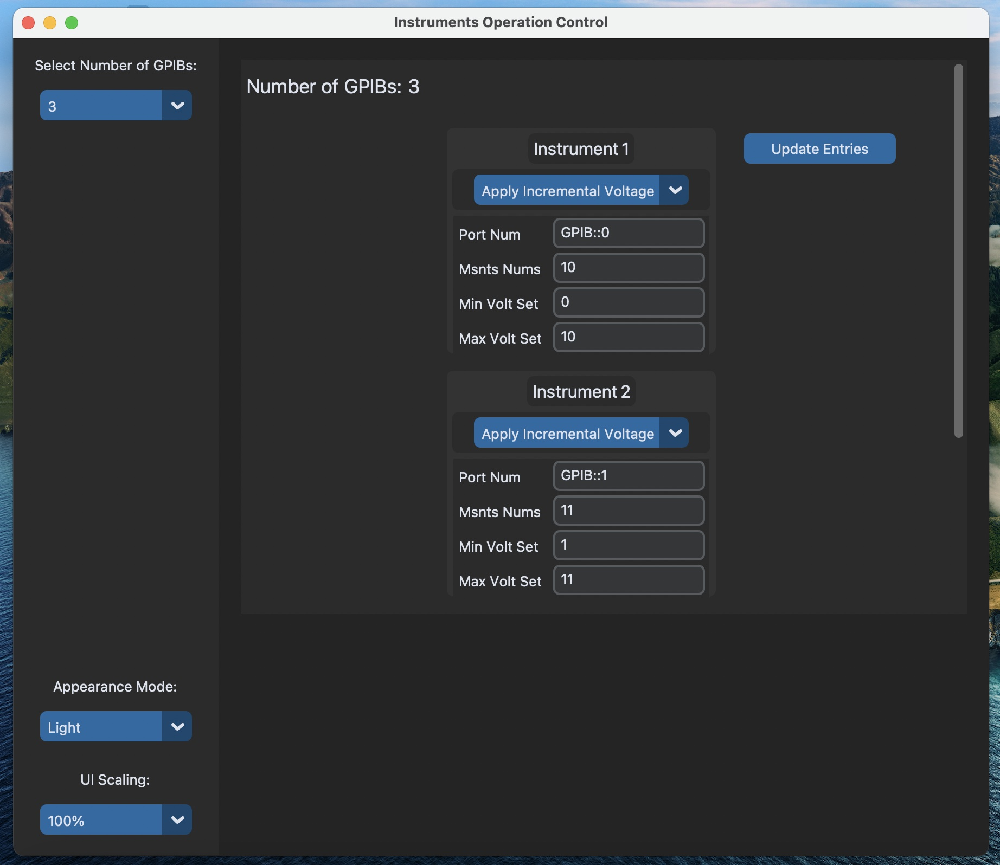

# Source-Meter-PyMeasure
Keithley SourceMeter using PyMeasure

**Run the program named `console_UI.py`**

There are additional programs and different version:
- There are `Tkinter` & `Custom` Tkinter examples for future use
- There are different versions of the `console_UI.py` as we progressed. 
  - Every version is executable. 
